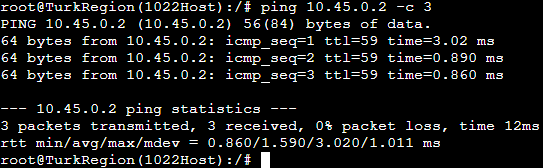
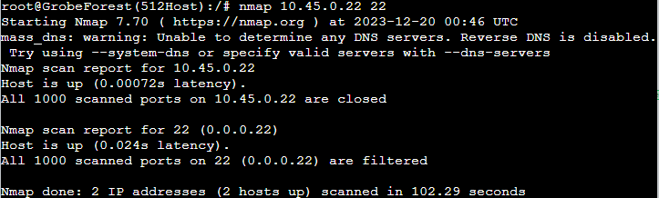

# Jarkom-Modul-2-E17-2023
Kelompok E17 -
Jaringan Komputer (F) </br>
*Insitut Teknologi Sepuluh Nopember*

**Authors :**
| Name                  | Student ID |
| ----------------------|------------|
| Rizky Alifiyah Rahma  | 5025211208 |
| Dilla Wahdana         | 5025211234 |

## Topologi


## Rute Subnet


| Subnet | Rute | Jumlah IP | Netmask |
| --- | --- | --- | --- |
| A1 | Fern-Switch2-Revolte | 2 | /30 |
| A2 | Fern-Richter | 2 | /30 |
| A3 | Himmel-Switch6-SchwerMountains-Fern | 66 | /25 |
| A4 | Himmel-Laubhills | 256 | /23 |
| A5 | Frieren-Himmel | 2 | /30 |
| A6 | Aura-Frieren | 2 | /30 |
| A7 | Aura-Heiter | 2 | /30 |
| A8 | Frieren-Stark | 2 | /30 |
| A9 | Heiter-TurkRegion | 1023 | /21 |
| A10 | Heiter-Switch3-Sein-GrobeForest | 514 | /22 |
| TOTAL | --- | 1871 | /20 |

## Tree VLSM


| Subnet | Network ID | Netmask | Broadcast |
| --- | --- | --- | --- |
| A1 | 10.45.0.0 | 255.255.255.252 | 10.45.0.3 |
| A2 | 10.45.0.4 | 255.255.255.252 | 10.45.0.7 |
| A3 | 10.45.0.128 | 255.255.255.128 | 10.45.0.255 |
| A4 | 10.45.2.0 | 255.255.254.0 | 10.45.3.255 |
| A5 | 10.45.0.8 | 255.255.255.252 | 10.45.0.11 |
| A6 | 10.45.0.12 | 255.255.255.252 | 10.45.0.15 |
| A7 | 10.45.0.16 | 255.255.255.252 | 10.45.15.255 |
| A8 | 10.45.0.20 | 255.255.255.252 | 10.45.0.23 |
| A9 | 10.45.8.0 | 255.255.248.0 | 10.45.15.255 |
| A10 | 10.45.4.0 | 255.255.252.0 | 10.45.7.255 |

## Konfigurasi Subnetting
#### Aura
```
auto eth0
iface eth0 inet dhcp

auto eth1
iface eth1 inet static
	address 10.45.0.17
	netmask 255.255.255.252

auto eth2
iface eth2 inet static
	address 10.45.0.13
	netmask 255.255.255.252
```
#### Heiter
```
auto eth0
iface eth0 inet static
	address 10.45.0.18
	netmask 255.255.255.252
	gateway 10.45.0.17

auto eth1
iface eth1 inet static
	address 10.45.8.1
	netmask 255.255.248.0

auto eth2
iface eth2 inet static
	address 10.45.4.1
	netmask 255.255.252.0
```
#### TurkRegion
```
auto eth0
iface eth0 inet static
	address 10.45.8.2
	netmask 255.255.248.0
	gateway 10.45.8.1
```
#### Sein
```
auto eth0
iface eth0 inet static
	address 10.45.4.2
	netmask 255.255.252.0
	gateway 10.45.4.1
```
#### GrobeForest
```
auto eth0
iface eth0 inet static
	address 10.45.4.3
	netmask 255.255.252.0
	gateway 10.45.4.1
```
#### Frieren
```
auto eth0
iface eth0 inet static
	address 10.45.0.14
	netmask 255.255.255.252
	gateway 10.45.0.13

auto eth1
iface eth1 inet static
	address 10.45.0.21
	netmask 255.255.255.252

auto eth2
iface eth2 inet static
	address 10.45.0.9
	netmask 255.255.255.252
```
#### Stark
```
auto eth0
iface eth0 inet static
	address 10.45.0.22
	netmask 255.255.255.252
	gateway 10.45.0.21
```
#### Himmel
```
auto eth0
iface eth0 inet static
	address 10.45.0.10
	netmask 255.255.255.252
	gateway 10.45.0.9

auto eth1
iface eth1 inet static
	address 10.45.2.1
	netmask 255.255.254.0

auto eth2
iface eth2 inet static
	address 10.45.0.129
	netmask 255.255.255.128
```
#### LaubHills
```
auto eth0
iface eth0 inet static
	address 10.45.2.2
	netmask 255.255.254.0
	gateway 10.45.2.1
```
#### SchwerMountain
```
auto eth0
iface eth0 inet static
	address 10.45.0.131
	netmask 255.255.255.128
	gateway 10.45.0.129
```
#### Fern
```
auto eth0
iface eth0 inet static
	address 10.45.0.130
	netmask 255.255.255.128
	gateway 10.45.0.129

auto eth1
iface eth1 inet static
	address 10.45.0.5
	netmask 255.255.255.252

auto eth2
iface eth2 inet static
	address 10.45.0.1
	netmask 255.255.255.252
```
#### Richter
```
auto eth0
iface eth0 inet static
	address 10.45.0.6
	netmask 255.255.255.252
	gateway 10.45.0.5
```
#### Revolte
```
auto eth2
iface eth2 inet static
	address 10.45.0.2
	netmask 255.255.255.252
	gateway 10.45.0.1
```

## Routing
#### Aura
```
route add -net 10.45.0.20 netmask 255.255.255.252 gw 10.45.0.14
route add -net 10.45.0.8 netmask 255.255.255.252 gw 10.45.0.14
route add -net 10.45.2.0 netmask 255.255.254.0 gw 10.45.0.14
route add -net 10.45.0.128 netmask 255.255.255.128 gw 10.45.0.14
route add -net 10.45.0.4 netmask 255.255.255.252 gw 10.45.0.14
route add -net 10.45.0.0 netmask 255.255.255.252 gw 10.45.0.14

#kanan
route add -net 10.45.0.16 netmask 255.255.255.252 gw 10.45.0.18
route add -net 10.45.8.0 netmask 255.255.248.0 gw 10.45.0.18
route add -net 10.45.4.0 netmask 255.255.252.0 gw 10.45.0.18
```
#### Revolte
```
route add -net 10.45.0.8 netmask 255.255.248.0 gw 10.45.8.1
route add -net 10.45.4.0 netmask 255.255.252.0 gw 10.45.4.1
```
#### Heiter
```
route add -net 10.45.0.12 netmask 255.255.255.252 gw 10.45.0.17
route add -net 10.45.0.20 netmask 255.255.255.252 gw 10.45.0.17
route add -net 10.45.0.8 netmask 255.255.255.252 gw 10.45.0.17
route add -net 10.45.2.0 netmask 255.255.255.252 gw 10.45.0.17
route add -net 10.45.0.128 netmask 255.255.255.252 gw 10.45.0.17
route add -net 10.45.0.4 netmask 255.255.255.252 gw 10.45.0.17
route add -net 10.45.0.0 netmask 255.255.255.252 gw 10.45.0.17
```
#### Frieren
```
route add -net 10.45.0.20 netmask 255.255.255.252 gw 10.45.0.21
route add -net 10.45.0.8 netmask 255.255.255.252 gw 10.45.0.10
route add -net 10.45.2.0 netmask 255.255.254.0 gw 10.45.0.10
route add -net 10.45.0.128 netmask 255.255.255.128 gw 10.45.0.10
route add -net 10.45.0.4 netmask 255.255.255.252 gw 10.45.0.10
route add -net 10.45.0.0 netmask 255.255.255.252 gw 10.45.0.10
```
#### Fern
```
route add -net 10.45.0.0 netmask 255.255.255.252 gw 10.45.0.1
route add -net 10.45.0.4 netmask 255.255.255.252 gw 10.45.0.5
```
#### Himmel
```
route add -net 10.45.2.0 netmask 255.255.254.0 gw 10.45.2.1
route add -net 10.45.0.128 netmask 255.255.255.128 gw 10.45.0.129
route add -net 10.45.0.0 netmask 255.255.255.252 gw 10.45.0.130
route add -net 10.45.0.4 netmask 255.255.255.252 gw 10.45.0.130
```

## Konfigurasi DHCP
### Konfigurasi DHCP Server
- Sebelum setup DHCP Server dan Relay, pastikan setiap node sudah terkoneksi dengan internet. Untuk keperluan setup, menggunakan iptables pada Aura
```
ETH0_IP=$(ip -4 addr show eth0 | grep -oP '(?<=inet\s)\d+(\.\d+){3}')
iptables -t nat -A POSTROUTING -o eth0 -j SNAT --to-source $ETH0_IP
```
- Update package lists dan install isc-dhcp-server dengan perintah sebagai berikut.
```
apt-get update
apt-get install isc-dhcp-server
```
- Menentukan interface. interface dari Revolte yang menuju ke switch adalah eth0, maka kita akan memilih interface eth0 untuk diberikan layanan DHCP.
```
nano /etc/default/isc-dhcp-server
INTERFACESv4=”eth0”
```
- setting file dhcp.conf pada node DHCP Server (Revolte)
```
subnet 10.45.0.0 netmask 255.255.255.252 {
}

subnet 10.45.0.4 netmask 255.255.255.252 {
}

subnet 10.45.0.128 netmask 255.255.255.128 {
    range 10.45.0.131 10.45.0.154;
    option routers 10.45.0.129;
    option broadcast-address 10.45.0.255;
    default-lease-time 180;
    max-lease-time 5760;
}

subnet 10.45.2.0 netmask 255.255.254.0 {
    range 10.45.2.2 10.45.3.254;
    option routers 10.45.2.1;
    option broadcast-address 10.45.2.255;
    default-lease-time 180;
    max-lease-time 5760;
}

subnet 10.45.0.8 netmask 255.255.255.252 {
}

subnet 10.45.0.12 netmask 255.255.255.252 {
}

subnet 10.45.0.16 netmask 255.255.255.252 {
}

subnet 10.45.0.20 netmask 255.255.255.252 {
}

subnet 10.45.8.0 netmask 255.255.248.0 {
    range 10.45.8.2 10.45.15.254;
    option routers 10.45.8.1;
    option broadcast-address 10.45.15.255;
    default-lease-time 180;
    max-lease-time 5760;
}

subnet 10.45.4.0 netmask 255.255.252.0 {
    range 10.45.4.3 10.45.7.254;
    option routers 10.45.4.1;
    option broadcast-address 10.45.7.255;
    default-lease-time 180;
    max-lease-time 5760;
}
```
- copykan file isc-dhcp-server ke folder /etc/default
```
cp isc-dhcp-server /etc/default/isc-dhcp-server
```
- Restart Service isc-dhcp-server Dengan Perintah
```
service isc-dhcp-server restart
```
### Konfigurasi DHCP Relay
- Lakukan beberapa instalasi sebelum melakukan konfigurasi pada Fern, Himmel, Frieren, Aura, Heiter. Instalasi yang dilakukan adalah sebagai berikut.
```
apt-get update
apt-get install isc-dhcp-relay -y
service isc-dhcp-relay start
```
- Melakukan Konfigurasi pada isc-dhcp-relay dengan script berikut:
```
nano /etc/default/isc-dhcp-relay
SERVERS="10.45.0.2"
INTERFACE="eth0 eth1 eth2"
```
- Melakukan Konfigurasi IP Forwarding pada /etc/sysctl.conf
```
nano /etc/sysctl.conf
net.ipv4.ip_forward=1
```
- Kemudian, restart service isc-dhcp-relay
```
service isc-dhcp-relay restart
```

## Soal 1
> Agar topologi yang kalian buat dapat mengakses keluar, kalian diminta untuk mengkonfigurasi Aura menggunakan iptables, tetapi tidak ingin menggunakan MASQUERADE.

### Script Pengerjaan
- Pada node Aura, tambahkan konfigurasi sebagai berikut
```
ETH0_IP=$(ip -4 addr show eth0 | grep -oP '(?<=inet\s)\d+(\.\d+){3}')
iptables -t nat -A POSTROUTING -o eth0 -j SNAT --to-source $ETH0_IP
```
Keterangan
-t nat menunjukkan bahwa aturan yang dibuat akan berada pada tabel NAT.
-A POSTROUTING menunjukkan bahwa aturan yang dibuat akan diletakkan pada chain POSTROUTING.
-o eth0 menunjukkan bahwa paket yang akan dikenai aturan ini adalah paket yang keluar melalui interface eth0.
-j SNAT menunjukkan bahwa paket yang dikenai aturan ini akan mengalami perubahan source address.
--to-source $ETH0_IP menunjukkan bahwa source address dari paket yang dikenai aturan ini akan diubah menjadi IP address dari interface eth0.
-s 192.202.0.0/20 menunjukkan bahwa paket yang dikenai aturan ini adalah paket yang berasal dari semua subnet

- Testing dengan melakukan ping google
```
ping google.com
```

### Hasil
- Client

TurkRegion


GrobeForest


LaubHills


- Router

Heiter


Frieren


Himmel


Fern


- Web Server

Sein


Stark


## Soal 2
> Kalian diminta untuk melakukan drop semua TCP dan UDP kecuali port 8080 pada TCP.

### Script Pengerjaan
Tambahkan konfigurasi berikut pada client
```
iptables -F
iptables -A INPUT -p tcp -j DROP
iptables -A INPUT -p udp -J DROP
iptables -I INPUT -p tcp --dport 8080 -j ACCEPT
```
Keterangan
- Menghapus semua aturan iptables yang sudah ada.
- Menyaring semua paket TCP yang masuk (INPUT) dan langsung menolaknya (DROP).
- Menyaring semua paket UDP yang masuk (INPUT) dan langsung menolaknya (DROP).
- Mengizinkan (ACCEPT) paket TCP yang masuk (INPUT) dengan tujuan port 8080.

### Hasil


## Soal 3
> Kepala Suku North Area meminta kalian untuk membatasi DHCP dan DNS Server hanya dapat dilakukan ping oleh maksimal 3 device secara bersamaan, selebihnya akan di drop.

### Script Pengerjaan
Pada DNS (Richter)dan DHCP server (Revolte) lakukan konfigurasi iptables sebagai berikut
```
iptables -A INPUT -m state --state ESTABLISHED,RELATED -j ACCEPT
iptables -A INPUT -p icmp -m connlimit --connlimit-above 3 --connlimit-mask 0 -j DROP
```
Keterangan
- --connlimit-above 3 maka paket ICMP selanjutnya akan ditolak (DROP) dari alamat sumber tersebut. -
- --connlimit-mask 0 menunjukkan bahwa pengecekan jumlah koneksi dilakukan berdasarkan alamat IP sumber secara langsung.

- Ping DNS Server (Revolte) pada client
```
ping 10.45.0.2 -c 3
```
### Hasil
TurkRegion



GrobeForest


LaubHills


SchwerMountain


Node SchwerMountain tidak mendapatkan paket data

## Soal 4
> Lakukan pembatasan sehingga koneksi SSH pada Web Server hanya dapat dilakukan oleh masyarakat yang berada pada GrobeForest.

### Script Pengerjaan
- Update package lists dan install netcat dengan perintah sebagai berikut.
```
apt-get update
apt-get install netcat
```
- Lakukan konfigurasi pada Web Server (Sein dan Stark) sebagai berikut
```
iptables -F
iptables -A INPUT -p tcp --dport 22 -s 10.45.4.0/22 -j ACCEPT
iptables -A INPUT -p tcp --dport 22 -j DROP
```
Keterangan
- iptables -A INPUT -p tcp --dport 22 -s 10.45.4.0/22 -j ACCEPT menunjukkan bahwa paket TCP yang menuju port 22 akan diterima jika berasal dari subnet 10.45.4.0/22.
- iptables -A INPUT -p tcp --dport 22 -j DROP menunjukkan bahwa paket TCP yang menuju port 22 akan ditolak.

- melakukan testing pada client
```
nmap 10.45.0.22 22
```
```
nc 10.45.0.22 22
```
### Hasil
mengkoneksikan ke salah satu web server (stark)



test1


connect(stark)


test2


unconnection(sein)


Pada node GrobeForest berhasil bind ke Stark Pada node LaubHills tidak bisa bind ke Sein

## Soal 5
> Selain itu, akses menuju WebServer hanya diperbolehkan saat jam kerja yaitu Senin-Jumat pada pukul 08.00-16.00.

### Script Pengerjaan
- Pada Web Server (Sein dan Stark) tambahkan konfigurasi berikut
```
iptables -F
iptables -A INPUT -p tcp --dport 22 -s 10.45.4.0/22 -m time --timestart 08:00 -$8:00 --timestop 16:00 --weekdays Mon,Tue,Wed,Thu,Fri -j ACCEPT
iptables -A INPUT -p tcp --dport 22 -j DROP
```
Keterangan
- iptables -A INPUT -p tcp --dport 22 -s 10.45.4.0/22 -m time --timestart 08:00 -$8:00 --timestop 16:00 --weekdays Mon,Tue,Wed,Thu,Fri -j ACCEPT menunjukkan bahwa paket TCP yang menuju port 22 akan diterima dalam jangka waktu Senin-Jumat pada pukul 08.00-16.00.
- iptables -A INPUT -p tcp --dport 22 -j DROP menunjukkan bahwa paket TCP yang menuju port 22 selain waktu sebelumnya akan ditolak.

- Lakukan testing pada client dengan perintah
```
# Jum'at, 15 Desember 2023 09:00
date 121509002023

# Jum'at, 15 Desember 2023 18:00
date 121518002023
```
- Lakukan nmap dengan menghubungkan ke ip web server (stark)
```
nmap 10.45.0.22 22
```

### Hasil
Jum'at, 15 Desember 2023 09:00 


Jum'at, 15 Desember 2023 18:00


## Soal 6
> Lalu, karena ternyata terdapat beberapa waktu di mana network administrator dari WebServer tidak bisa stand by, sehingga perlu ditambahkan rule bahwa akses pada hari Senin - Kamis pada jam 12.00 - 13.00 dilarang (istirahat maksi cuy) dan akses di hari Jumat pada jam 11.00 - 13.00 juga dilarang (maklum, Jumatan rek).

### Script Pengerjaan
Untuk menyelesaikan nomor 6, diperlukan rules iptables baru menggunakan syntax:
```bash
iptables -F

iptables -A INPUT -p tcp -- dport 22 -s 10.45.4.0/22 -m time --timestart 12:00 --timestop 13:00 --weekdays Mon,Tue,Wed,Thu  -j DROP

iptables -A INPUT -p tcp -- dport 22 -s 10.45.4.0/22 -m time --timestart 11:00 --timestop 13:00 --weekdays Fri -j DROP
```

Dari rules tersebut, SSH akan bekerja pada hari kerja yaitu Senin hingga kamis dan Jumat di jam tertentu.

### Hasil


## Soal 7
> Karena terdapat 2 WebServer, kalian diminta agar setiap client yang mengakses Sein dengan Port 80 akan didistribusikan secara bergantian pada Sein dan Stark secara berurutan dan request dari client yang mengakses Stark dengan port 443 akan didistribusikan secara bergantian pada Sein dan Stark secara berurutan.

### Script Pengerjaan

Untuk menyelesaikan nomor 7, perlu mengaktifkan rules pada iptables di router yang terhubung dengan webserver yang ingin digunakan, yaitu Sein dan Stark. Berikut adalah rules iptables yang saya pakai:

```bash
iptables -t nat -F PREROUTING

iptables -A PREROUTING -t nat -p tcp --dport 80 -d 10.45.4.2 -m statistic --mode nth --every 2 --packet 0 -j DNAT --to-destination 10.45.4.2

iptables -A PREROUTING -t nat -p tcp --dport 80 -d 10.45.4.2 -j DNAT --to-destination 10.45.0.22

iptables -A PREROUTING -t nat -p tcp --dport 443 -d 10.45.0.22 -m statistic --mode nth --every 2 --packet 0 -j DNAT --to-destination 10.45.0.22

iptables -A PREROUTING -t nat -p tcp --dport 443 -d 10.45.0.22 -j DNAT --to-destination 10.45.4.2
```

Pada script tersebut, terdapat 4 rules untuk 2 port yang berbeda:
- Akses menuju Sein di port 80
	- Baris pertama: Paket akan diarahkan ke alamat tujuan 10.45.8.2 apabila paket yang menuju ke port 80 pada alamat tersebut adalah paket yang kedua.
	- Baris kedua: Paket akan diarahkan ke alamat tujuan 10.45.0.22 apabila paket bukan paket kedua
- Akses menuju Stark di port 443
	- Baris ketiga: Paket akan diarahkan ke alamat tujuan 10.45.0.22 apabila paket yang menuju port 443 pada alamat tersebut adalah paket kedua
	- Baris keempat: Paket akan diarahkan ke alamat tujuan 10.45.4.2 

Kemudian dilakukan testing dengan membuka koneksi pada webserver, baik itu sein ataupun stark. Untuk port 80 menggunakan syntax ```while true; do nc -l -p 80 -c 'echo "ini sein"'; done``` di sein dan ```while true; do nc -l -p 80 -c 'echo "ini stark"'; done``` di stark. Untuk port 443 menggunakan syntax ```while true; do nc -l -p 443 -c 'echo "ini sein"'; done``` di sein dan ```while true; do nc -l -p 443 -c 'echo "ini stark"'; done``` di stark.

### Hasil
Berikut adalah salah satu hasil testing di port 80:


## Soal 8
> Karena berbeda koalisi politik, maka subnet dengan masyarakat yang berada pada Revolte dilarang keras mengakses WebServer hingga masa pencoblosan pemilu kepala suku 2024 berakhir. Masa pemilu (hingga pemungutan dan penghitungan suara selesai) kepala suku bersamaan dengan masa pemilu Presiden dan Wakil Presiden Indonesia 2024.

### Script Pengerjaan
Untuk menyelesaikan nomor 8, diperlukan penambahan rules pada webserver Sein maupun Stark dengan syntax:
```bash
iptables -F

Subnet_Revolte="10.45.0.0/30"

Mulai_Pemilu=$(date -d "2023-10-19T00:00" +"%Y-$m-$dT%H:%M")

Akhir_Pemilu=$(date -d "2024-02-15T00:00" +"%Y-$m-$dT%H:%M")

iptables -A INPUT -p tcp -s $Subnet_Revolte --dport 80 -m time --datestart "$Mulai_Pemilu" --datestop "$Akhir_Pemilu" -j DROP
```

### Hasil
Testing dapat dilakukan dengan mengubah-ubah date sesuai yang diminta pada soal. Berikut adalah salah satu hasil testingnya:


## Soal 9
> Sadar akan adanya potensial saling serang antar kubu politik, maka WebServer harus dapat secara otomatis memblokir  alamat IP yang melakukan scanning port dalam jumlah banyak (maksimal 20 scan port) di dalam selang waktu 10 menit. 
(clue: test dengan nmap)

### Script Pengerjaan
Untuk penyelesaian nomor 9, perlu dilakukan konfigurasi iptables pada Sein dan Stark menggunakan syntax berikut:
```bash
iptables -F

iptables -N portscan

iptables -A INPUT -m recent --name portscan --update --seconds 600 -- hitcount 20 -j DROP
iptables -A FORWARD -m recent --name portscan --update --seconds 600 --hitcount 20 -j DROP

iptables -A INPUT -m recent --name portscan --set -j ACCEPT
iptables -A FORWARD -m recent --name portscan --set -j ACCEPT
```
Pada rules tersebut, terdapat informasi:
- ```-N portscan``` : membuat chain baru yang akan digunakan untuk menyimpan informasi mengenai port yang telah di scanning
- ```-m recent --name portscan --update --seconds 600 --hitcount 20``` : untuk scanning sebuah port diperlukan modul ```recent``` dan menerapkan aturan akan dilakukan update pada ```hitcount``` setiap 600 detik. dan jika jumlah percobaan sudah melebihi 20 kali, maka paket tersebut akan ditolak.

sehingga dapat disimpulkan bahwa syntax yang berada di webserver tersebut akan mengecek terlebih dahulu apakah alamat IP tersebut berada di dalam rantai portscan dan telah melakukan 20 percobaan scanning dalam 10 menit terakhir atau tidak. Ketika ada IP yang melanggar rules tersebut, maka IP tersebut akan diblokir

### Hasil
 

Setelah ping ke-20, ping tidak akan lagi diterima karena aturan tersebut

## Soal 10
> Karena kepala suku ingin tau paket apa saja yang di-drop, maka di setiap node server dan router ditambahkan logging paket yang di-drop dengan standard syslog level. 

### Script Pengerjaan
Untuk menyelesaikan nomor 10, perlu menggunakan syntax berikut di seluruh webserver dan router:
```bash
iptables -A INPUT  -j LOG --log-level debug --log-prefix 'Dropped Packet' -m limit --limit 1/second --limit-burst 10
```

Dalam syntax tersebut terdapat informasi:
- ```-A INPUT``` : menambahkan rules ke chain INPUT
- ```-j LOG``` : Menentukan bahwa jika paket tersebut memenuhi kondisi rules, maka pesan akan tercatat di log
- ```--log-level debug``` : Menentukan level log yang akan digunakan, yaitu debug. Level log ini menunjukkan bahwa pesan log yang dihasilkan akan memeliki tingkat detail debug yang lebih rinci
- ```--log-prefix 'Dropped Packet'``` : Menetapkan prefix atau awalan untuk setiap entri log, yaitu "Dropped Packet"
- ```-m limit --limit 1/second --limit-burst 10``` : Mengatur batasan pada jumlahh log yang akan dicatat menggunakan modul ```limit```
- ```--limit 1/second``` : Menetapkan batasan sebanyak 1 log per detik
- ```--limit-burst 10``` : Menetapkan jumlah log yang dapat dilakukan dalam 1 waktu sebelum batasan per detik diambil kembali
### Hasil
           
